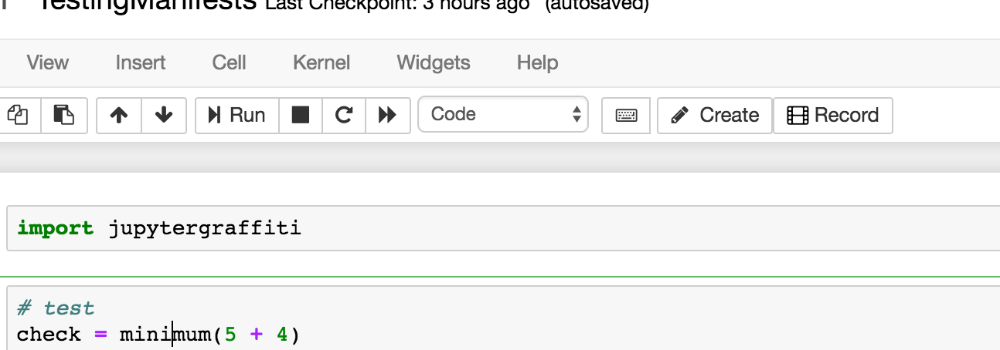
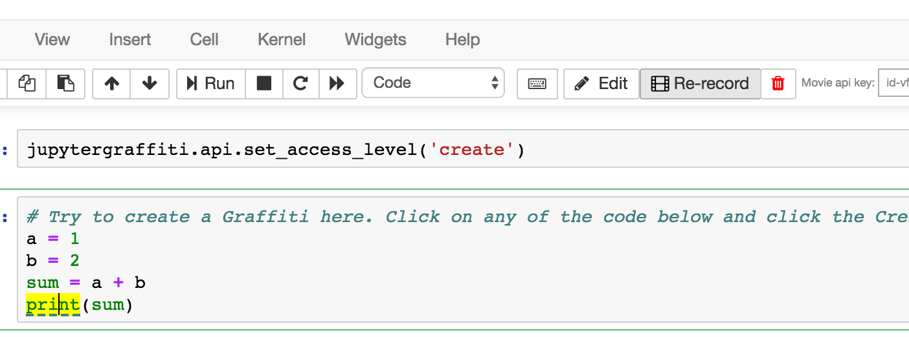
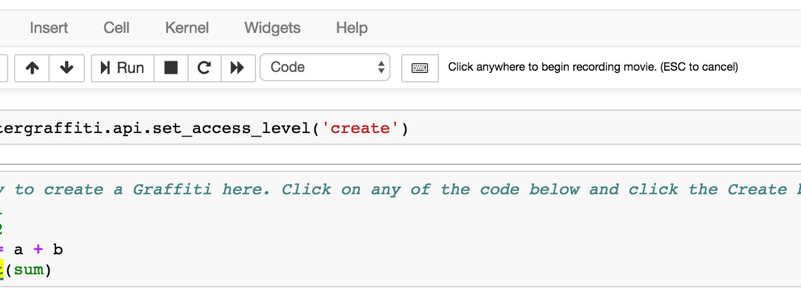
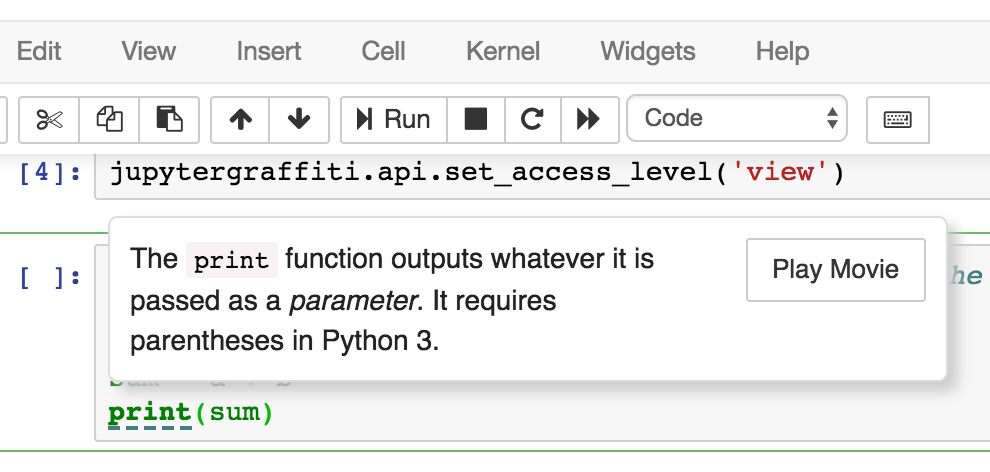

# Jupyter Graffiti

Create interactive screencasts inside Jupyter Notebook that anybody can play back.


Ever wanted to offer someone a hands-on demo in Jupyter Notebook? Now
you can! Just add __Graffiti__, and any text inside a code cell can be
annotated with a hoverable tip (a *Graffiti* ) where you can explain
the code in whatever detail you want (with markdown)!

Even better, you can attach a screen recording to a _Graffiti_ of any
actions you take in your notebook, including:

* Recorded audio (e.g. voice narration), captured with your laptop's microphone while making your recording
* Mouse movement and scrolling in the notebook
* Selecting and editing inside code cells
* The output of any code cell executions
* You can also draw and highlight over sections you think are important, or create handwritten notes.

All of this activity can be played back by hovering over the _Graffiti_ and clicking the _Play Movie_ button.


## Table of Contents

* [Demo](#demo)
* [Advantages of Graffiti Over Traditional Screencasts](#advantages-of-graffiti-over-traditional-screencasts)
* [Installation](#installation)
* [Using Jupyter Graffiti](#using-jupyter-graffiti)
* [Using the Jupyter Graffiti Python API](#using-the-jupyter-graffiti-python-api)

## Demo

You can see a live demonstration of a Notebook with _Graffitis_ by clicking the Binder badge below:

[](https://mybinder.org/v2/gh/willkessler/jupytergraffiti/master?filepath=samples%2FIntroductionToGraffiti.ipynb)

Please wait about 30 seconds for the demonstration to spin up at <a href="mybinder.org">mybinder.org</a>. (Props to the folks at MyBinder for this awesome service).

You can also find more sample Notebooks with *Graffitis* in the `samples/` directory.

## Advantages of _Graffiti_ Over Traditional Screencasts

* You can save any number of _Graffitis_ in a Notebook.
* You don't need any special software or hardware (other than this library and Chrome/Safari/Firefox) to create and save _Graffitis_.
* Viewers can pause recorded playback any time, scrub forward and
backward, and interact with the Notebook during playback at any
point. No need to watch a whole recorded screencast first, and then
switch context to a Notebook; students can explore right along with
you in the same environment you recorded in. When you pause a
recording, you're still in a live notebook, so you can play around.
* _Jupyter Graffiti_ is easy to set up: either use the Python library
  or build the Docker image with the included Jupyter extension.  (At
  Udacity, Jupyter Notebook Workspaces use the extension. See below
  how to install it).
* All data, including audio, is stored in compressed plain text in a
  directory separate from your notebook files, for easy portability and
  storage in any version control system.
* Unlike streamed video, you don't need a video server or hosted
  YouTube videos, and you can watch the videos even without an
  internet connection or over narrow bandwidth, because the files are
  very small.

## Installation

There are three ways to use _Jupyter Graffiti_: by using a Python library, by using a Docker image, or by installing a plugin into your Jupyter Notebook server.

### Installation Option #1: Use the Python Library (Simplest Option)

*Note*: Before using this method, you may need to Trust your
notebook. This is because _Jupyter Graffiti_ is built in Javascript,
and by default, if the notebook you're adding _Graffitis_ to was not
created by you, Jupyter Notebook will not "Trust" it and will not run
externally loaded javascript code, for security reasons.  To Trust a
notebook, click `File...Trust Notebook`*before* running the import
command below.

1. `git clone` this repo in the same directory where you keep the Notebook(s) you want to add _Graffiti_ to.
1. Add and run the following command in a cell in the Notebook you want to start adding _Graffiti_ to:

```
import jupytergraffiti
```

If everything works, you should see the following message displayed in your Jupyter menu bar for 5 seconds, before fading out:


If you don't see this message appearing, use `Kernel... Restart and Clear Output` first, then try running ```import jupytergraffiti``` again.


By default, *Jupyter Graffiti* starts off in *View* mode, ie you can
only play _Graffitis_ already added to a Notebook. To create your very
first _Graffiti_ in a Notebook that has none, you will need to switch
to *Create* mode. Assuming you've already run `import
jupytergraffiti`, you must execute this (in a cell by itself):

```
jupytergraffiti.api.set_access_level('create')
```

Now, clicking anywhere in a code cell will show the _Graffiti_ content creation controls:


From here you can start to create *Graffitis*. Jump to [Using Jupyter Graffiti](#using-jupyter-graffiti) to learn more.

**Special Note** : if you are adding *Graffitis* to Notebooks that do not reside in the same folder where you cloned this repo, then you must :

1. Create a `recording_data` directory in the folder where you cloned this repo (`mkdir recording_data`).
1. Create symbolic links from the directory where you notebook resides
   to both the `jupytergraffiti` folder in this repo, and to the
   `recording_data` folder alongside where you cloned this repo.

An example of this setup is to be found inside the `samples/`
directory, where we have symlinks to both directories at one level
up. To make this work properly, we needed to be sure that the
`recording_data/` directory exists at one level up so that the symlink
will work. *Jupyter Graffiti* will create directories for storage via
the symlink but it cannot create the `recording_data` directory itself
unless it is to be created in the same directory as the notebook
itself.


### Installation Option #2: Run Jupyter Notebook with a Docker Image Containing Graffiti (Slightly More Complex Option)

Make sure to **[install Docker](https://docs.docker.com/install)** on your system first (unless you've already installed it).

Then enter this command in a terminal on your computer:

```
./jupytergraffiti/build_and_run.sh
```

This will build and start up a Docker container running the Jupyter
Server and the _Jupyter Graffiti_ extension, with the container's home
directory being mounted where your Jupyter Notebook(s) are located,
and serving Notebooks over port 8888.

The advantage of using the Docker container is that *Jupyter Graffiti*
is always loaded automatically, so you don't have to execute `import
jupytergraffiti` in the Notebook just to play back *Graffitis* (but
you *will* need to run it to access the _Graffiti_ API and switch to
*Create* mode).

using the Docker container also ensures you're running a recent
version of Jupyter Notebook.


Take a look at the output of the Jupyter Server running in the
container. It has the secret key you need to be able to surf to the Dockerized
Jupyter server. The output will look something like this (but note
that the Jupyter Server login token will change every time you run `build_and_run.sh`):

```
Copy/paste this URL into your browser when you connect for the first time,
    to login with a token:
        http://(b13ba2b482e9 or 127.0.0.1):8888/?token=e58a08f167881500e207ff9be05ad57ffe00e3457e54017c
```

What this is telling you is to surf to
`http://localhost:8888?token=e58a08f167881500e207ff9be05ad57ffe00e3457e54017c`
to access the Jupyter Server with the _Graffiti_ extension installed and
running.

The Docker container will serve content out of port 8888. If you already have
something (e.g. another Jupyter server) running on this port, pass a different port to
`build_and_run.sh` like so:

```
./jupytergraffiti/build_and_run.sh 8889

```

**Note**: if you specify a different port, the Jupyter Server output
containing the secret key will still show port 8888, because
internally it still uses port 8888; via Docker port mappings, we
have remapped 8888 to the port you specify. In the example above,
therefore, you would need to access the server at:
`http://localhost:8889?token=e58a08f167881500e207ff9be05ad57ffe00e3457e54017c`.

### Installation Option #3: Install the Graffiti Extension in Your Own Jupyter Server (Most Complex Option)

This will permanently install the extension in your computer's
installation of the Jupyter Server (although you can always disable
it if you want to). This means the extension will always be available
whenever you start up your Jupyter server. To install the extension:

```
cd jupytergraffiti
jupyter nbextension install graffiti_extension --symlink --user
jupyter nbextension enable graffiti_extension/main --user
cd ..
```

You may need to restart your Jupyter server to get the extension to load, although usually that's not required.

#### Disabling the Graffiti extension in your Jupyter Server

If you need to disable the _Graffiti_ plugin for some reason, you can easily do it.

To disable the plugin:

```
cd jupytergraffiti
jupyter nbextension disable graffiti_extension/main --user
cd ..
```

Then restart your Jupyter server.

## Using Jupyter Graffiti

### Creating and Editing _Graffitis_

To add a _Graffiti_, simply click in any text in any code cell and click
either *Create* or *Record*.



In either case you will be presented with
a new cell you can use for editing the markdown content shown when a
user of your notebook hovers over your _Graffiti_.  If you click in an
existing _Graffiti_, you will see *Edit* instead of *Create*, but the
process is the same.


Enter any markdown you want to show up in the _Graffiti_ tip, and
click Save Annotation.


The editing cell will now disappear, and you will
return to the cell where you were adding your _Graffiti_. The text
where you clicked now has an dashed underline. Mouse over the
underline to see your _Graffiti_ tip.


### Dressing Up Your Graffiti Tips

Within the markdown of a _Graffiti_, certain special controls are
available to you (optional). These are lines of markdown starting with
the special characters `%%`. These are:

1. `%%button_name` : Specify a different button title to display when you record a movie as part of your _Graffiti_. The default title is _Play Movie_.
1. `%%caption`     : Specify a special caption that appears at the top of this tip, formatted in boldface, such as _"Will explains..."_
1. `%%caption_pic` : Provide the markdown path to a small image you want to display to the left of the caption.

Here's an example of how you enter these special controls:


And here's how that looks. Note that the *Play Movie* button is now
renamed *Show me!*. You can get creative here, but don't go hogwild or
your tooltip might get too wide to be properly displayed. Some ideas
might be *Clue me in!*, *Say What?*, *Explain this more!*.


### Creating a Recording For a Graffiti

To create or replace a recording for a _Graffiti_, click the *Record*
button. You can either add a recording to an existing _Graffiti_ tip or
you can start by creating a recording first (this will automatically
create the tip as well).


If you already have a recording on a *Graffiti* then you will see *Re-Record* instead of *Record* displayed:



You must now enter some markdown for the tip that goes with this movie (but this can be placeholder if you're not ready to come up with this yet):


When you're happy with whatever text you want to put in the tip, click *Start Movie Recording*.

To begin recording your activities, click inside any cell. 



The system will now show you a timer indicating how long your recording has been going for (and some hints on how to finish recording):


When you've concluded your recording, click the *Finish* button or
press the ESC key. You will now see a message telling you your
recording is complete and a link you can use to play the recording
back to make sure it's OK.


You can also hover over your _Graffiti_ and
play the recording back from the tip.


### Drawing Lines and Highlights in Recordings

While you are recording for a _Graffiti_, you can draw lines and mark
yellow highlights.  Hold down Alt (Command on mac) to draw lines, hold
down Option to draw highlights. If you hold down both Command and
Option at once, you can erase the lines and highlights you drew. These
drawings and highlights can cover multiple cells (for instance if you
want to draw an arrow between two cells). They only exist while the
recording is played back; they will not appear otherwise.


### Removing a Single Graffiti

If you need to, you can remove any _Graffiti_ by clicking in its text and clicking the *Trash* button:


### Viewing and Playing Back _Graffitis_

The *Graffitis* are always associated with some code cell text. That
text becomes underlined with a dashed underline. Hovering over that
text will show the *Graffiti* tooltip.



If a recording is stored for that *Graffiti* and you press the *Play
Movie* button, the movie will start to play back. The current state of
the notebook will be saved and restored when the movie finishes, or
playback is cancelled. Playback controls look like this:


You can press __Spacebar__ to pause a recording. You can press __ESC__ at
any time to end the recording and return the notebook to its previous
state.

Note that we use Jupyter's tokenizer to choose how the *Graffiti* is
attached to which tokens. For instance, if you select part of a
comment, the entire comment becomes the token because to Jupyter, a
comment is a single token. However, Python keywords like `print` would
be a single token too. You can select multiple tokens to have a
*Graffiti* span them. Play around to see how this functions; you can
always remove a *Graffiti* and start over to adjust what's highlighted
for your *Graffiti*.  When you click inside an existing *Graffiti*
while in *Create* mode, the entire underline section gets a yellow
background so it's clear which tokens are being used for the
*Graffiti*.


## Using the Jupyter Graffiti Python API

When you `import jupytergraffiti` you get immediate access to
functions you can use to control _Jupyter Graffiti_ from Python. Some
of these are utility functions, and others can be used to control
recordings playback.  To use them, simply run the Python functions in your
notebook's cells.

#### Switching Access Levels

First off, you can set your access level to either *View* or *Create*. You may
wish to switch to *View* mode to preview what users will see by
default when they visit your _Graffiti'd_ notebook, and then switch
back. To switch back and forth, execute these in a cell by itself:

```
jupytergraffiti.api.set_access_level('view')
```

```
jupytergraffiti.api.set_access_level('create')
```

__Note__: the first time you switch to *Create* mode on your server, you will be asked
whether you want to to allow access to the computer's microphone. You must answer
__Yes__ if you want to record audio along with your _Graffiti_ recordings.

#### Playing Back Graffiti Recordings

You can also play any *Graffiti* recording back using Python
code. This could be valuable, for instance, after a student has failed
several times to make some code work; you could watch for this
situation in your testing code, and offer to play a hint
recording. Or, if a student's code passes all tests you can start up a
recording prompting them to go on to the next exercise.

To play back an existing *Graffiti*, first you need the "movie API
key" of the specific recording you want to play. When you click on any
*Graffiti* the movie API key is displayed in the menu bar (see
illustration below). Simply click inside it to auto-select its text, and then use
your browser's copy function to copy the text to your clipboard
(e.g. Cmd-C on Mac, Ctrl-C on PC).


Now paste that recording API key into this command in your code:

```
jupytergraffiti.api.play_recording('id-cgxukass1bi_id-towwksveqi')
```

(Note that the key shown above is just an example).

You can cancel playback on that recording with:

```
jupytergraffiti.api.stop_playback('id-cgxukass1bi_id-towwksveqi')
```

Finally, you can put up a unobtrusive (hint) prompt suggesting a user play back a specific recording:

```
jupytergraffiti.api.play_recording_with_prompt('id-cgxukass1bi_id-towwksveqi', 'Click here to learn about the next exercise!')
```

The first parameter is the recording API key as before. The second
parameter is a markdown string you can use to display for the
hint. For instance, we could call this function like so:

```
jupytergraffiti.api.play_recording_with_prompt('id-cgxukass1bi_id-mwgcuw6hnq', ' Need a hint? Click **here**.')
```

And this will produce a clickable hint in the Jupyter menu bar like so:


This may be useful if you want to queue up a recording for playback,
but still give the viewer the option to start it themselves rather
than have it play automatically.

#### Removing All Graffitis

To remove all *Graffitis* from a Notebook (for instance, when you want to start fresh),
execute this command in a cell by itself:

```
jupytergraffiti.api.remove_all_annotations()
```

You will get a prompt confirming whether this is something you really
want to go through with.

## Current Limitations of Jupyter Graffiti

* Jupyter Graffiti can record most activities in Notebooks, but it currently does not record adding and deleting cells.
* If you rearrange cells after making a recording, scrolling will try to align the cursor and the page as best it can with the cells you were mousing over and scrolling to, even if they are in a different order than when you made the original recording. However, due to complexities involving cell sizing, this process may not always be perfect.
* Copying cells does not copy their Graffiti.
* Make a Copy ... of the current Notebook will not create a copy of the recordings; in fact, it will use the same recording ID and therefore supplant recordings on the original notebook.
* Given this is the first version of this software, there may well be bugs. Feel free to report issues on Github and/or propose PR's.

## Future Plans

* In the next version of *Jupyter Graffiti* you will be able to
  automatically transcribe your spoken audio into subtitles that
  scroll along with the movie (leverages Google's Transcribe service,
  so you must be a Google Compute user). Stay tuned.

* We will add support for adding and deleting cells during a recording.

* Make a Copy ... of a notebook should copy the recordings to a new notebook recording ID.

* We are also working on collaborative *Graffitis*, where the author's
  *Graffitis* are displayed differently from any the viewers may
  add. This will permit students to add and share *Graffitis* with
  each other.

### CREDITS

Author/Maintainer: Will Kessler github:willkessler
Advisors: Andy Brown (design), Nathan Tate, Tugce Akin, Jesse Swidler (engineering)
