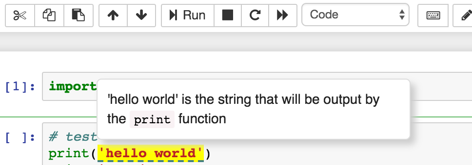
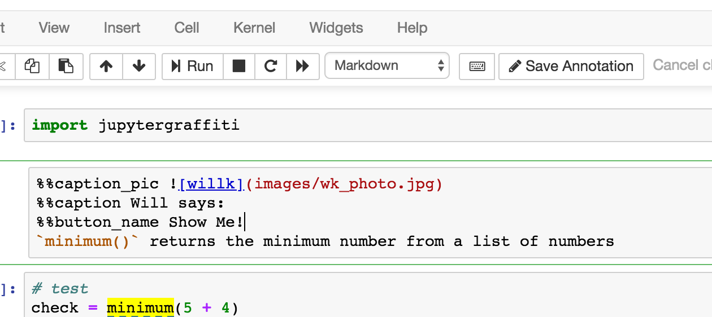
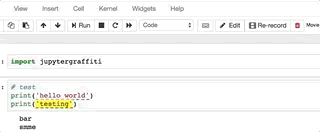

# Jupyter Graffiti

Create interactive screencasts inside Jupyter Notebook that anybody can play back.


Ever wanted to offer someone a hands-on demo in Jupyter Notebook? Now
you can! Just add _Graffiti_, and any text inside a code cell can be
annotated with a hoverable tip (a _Graffiti_ ) where you can explain
your code in whatever detail you want (with markdown)! 

Even better, you can attach a recording to any _Graffiti_ of selected
activities in your notebook, including:

* Recorded audio (e.g. voice narration), captured with your laptop's microphone while making your recording
* Mouse movement and scrolling in the notebook
* Selecting and editing inside code cells
* The output of any code cell executions
* You can also draw and highlight over sections you think are important, or create handwritten notes.

All of this activity can be played back by hovering over the _Graffiti_ and clicking the _Play Movie_ button.


## Demo

You can see a live demonstration of a Notebook with Graffiti here: (coming shortly)

Learning About Python Function Parameters

You can also find more samples in the `samples/` directory. (coming shortly)

## Advantages of _Graffiti_ Over Traditional Screencasts

* You can save any number of _Graffiti_ in a Notebook.
* You don't need any special software other than this library to create and save _Graffitis_.
* Viewers can pause recorded playback any time, scrub forward and backward, and interact with the Notebook during
playback at any point. No need to watch a whole recorded screencast first, and then switch context to a Notebook; students can explore right along with
you in the same environment you recorded in.
* Jupyter Graffiti is easy to set up: either use the Python library or build the Docker image with the included Jupyter extension.  (At Udacity, Jupyter Notebook Workspaces use the extension. See below how to accomplish this).
* All data, including audio, is stored in compressed plain text in a directory separate from your notebook files for easy portability and storage in any version control system.

## Installation

There are three ways to use _Jupyter Graffiti_: as a Python library, using a Docker image, or by installing a plugin into your Jupyter Notebook configuration. 

### Installation Option #1: Use the Python Library (Simplest Option)

1. `git clone` this repo in the same directory where you keep the Notebook(s) you want to add _Graffiti_ to.
1. Add and run this command in a cell in the Notebook you want to start adding _Graffiti_ to: 

```
import jupytergraffiti
```

If everything works, you should see the following message (temporarily) displayed in your Jupyter menu bar:


In addition, clicking in a code cell will show the _Graffiti_ content creation controls:


If you don't see either of these things, use `Kernel... Restart and Clear Output` first, then try running ```import jupytergraffiti``` again.


### Installation Option #2: Install a Docker image (Slightly More Complex Option) (coming shortly)

You'll need to [install Docker](https://docs.docker.com/install) first. Then you can take the following steps in a terminal shell on your laptop:

```
cd jupytergraffiti
./build.sh
cd ..
./jupytergraffiti/run.sh
```

This will start up a Docker container running the Jupyter Server and
the Jupyter Graffiti extension, with the container's home directory
being mounted where your Jupyter Notebook(s) are located.

The advantage of using the Docker container is that Jupyter Graffiti
is always loaded automatically so you don't have the run `import
jupytergraffiti` in the Notebook (unless you want access to the
Graffiti API, cf below for details on that).

The container will serve content out of port 8888. If you already have
a Jupyter server running on this port, pass a different port to
`run.sh` e.g. :

`./jupytergraffiti/run.sh 8889`

Take a look at the output of the Jupyter Server running in the container. It has the secret key you need to be able to surf to this Jupyter server:


### Installation Option #3: Install the Graffiti Extension in Your Own Jupyter Server (More Complex Option)

This will permanently install the extension in Jupyter (although you
can always uninstall it if you want to). This means the extension will
always be available whenever you start up your Jupyter server. To
install the extension:

```
cd jupytergraffiti
jupyter nbextension install jupytergraffiti/graffiti_extension --symlink --user
jupyter nbextension enable jupytergraffiti/graffiti_extension/main --user
```

You may need to restart your Jupyter server to get the extension to load, although usually that's not required.

#### Uninstalling the Graffiti extension from your Jupyter Server

To disable the plugin, you can visit
`~/.jupyter/nbconfig/notebook.json` and set
`"jupyter_graffit/graffiti_extension/main": false` in the
`"load_extensions"` block. Then restart the Jupyter server.

## Using _Jupyter Graffiti_

### Creating and Editing _Graffitis_

To add a _Graffiti_, simply click in any text in any code cell and click
either *Create* or *Record*. 


In either case you will be presented with
a new cell you can use for editing the markdown content shown when a
user of your notebook hovers over your _Graffiti_.  If you click in an
existing _Graffiti_, you will see *Edit* instead of *Create*, but the
process is the same.


Enter any markdown you want to show up in the _Graffiti_ tip, and
click Save Annotation.


The editing cell will now disappear, and you will
return to the cell where you were adding your _Graffiti_. The text
where you clicked now has an dashed underline. Mouse over the
underline to see your _Graffiti_ tip.




Within the markdown of a _Graffiti_, certain special controls are
available to you (optional). These are lines of markdown starting with
the special characters `%%`. These are:

1. `%%button_name` : Specify a different button title to display when you record a movie as part of your _Graffiti_. The default title is _Play Movie_.
1. `%%caption`     : Specify a special caption that appears at the top of this tip, formatted in boldface, such as _"Will explains..."_
1. `%%caption_pic` : Provide the markdown path to a small image you want to display to the left of the caption. 

Here's an example of how you enter these special controls:


And here's how that looks:


### Creating a Recording For a Graffiti

To create or replace a recording for a _Graffiti_, click the *Record*
button. You can either add a recording to an existing _Graffiti_ or
you can start by creating a recording first (this will automatically
create the tip as well).


You now must enter some markdown for the tip that goes with this movie (but this can be placeholder if you're not ready to come up with this yet):


When you're happy with whatever text you want to put in the tip, click *Start Movie Recording*.

To begin recording your activities, click inside any cell. You will
now see a timer indicating how long your recording has been going for (and some hints on how to finish recording):


When you've concluded your recording, click the *Finish* button or
press the ESC key. You will now see a message telling you your
recording is complete and a link you can use to play the recording
back to make sure it's OK. 


You can also hover over your _Graffiti_ and
play the recording back from the tip.


If you need to, you can remove any _Graffiti_ by clicking in its text and clicking the *Trash* button:


### Drawing Lines and Highlights in Recordings

While you are recording for a _Graffiti_, you can draw lines and mark
yellow highlights.  Hold down Alt (Command on mac) to draw lines, hold
down Option to draw highlights. If you hold down both Command and
Option at once, you can erase the lines and highlights you drew.



## Using the Jupyter Graffiti Python API

When you `import jupytergraffiti` you immediate get access to several
functions you can use to control Jupyter Graffiti from Python. Some of these
are utility functions and others can be used to control playback.

## Current Limitations of Jupyter Graffiti

* Jupyter Graffiti can record most activities in Notebooks, but it currently does not record adding and deleting cells. This is planned for a future release.
* If you rearrange cells after making a recording, scrolling will try to align the cursor and the page as best it can with the cells you were mousing over and scrolling to, even if they are in a different order than when you made the original recording. However, due to complexities in cell sizes, this may not always be perfect.
* This is version 1 of this software, so there may well be bugs. Feel free to report issues on Github and/or propose PR's.
